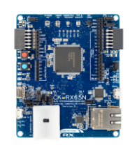

# About this repo

This is the repository for modify the Renesas RX LWIP examples to the GCC.

You can get the original driver and sample code below two links.

* RX Family Lightweight IP (lwIP) Module Using Firmware Integration Technology 
   https://www.renesas.com/search?keywords=R20AN0789

* RX Family lwIP (lightweight IP) Driver Firmware Integration Technology 
   https://www.renesas.com/ja/search?keywords=R20AN0788

# Projects

There are some examples, like `gcc_ck_rx65n_v2_lwip_tcp_client`.

These folders shows the kits and protocol and operation mode. 
 * `[target_compiler]_[Target_kit]_lwip_[protocol]_[server/client]`.

# Where modified

The examples are mainly changed below items.

### - Changed Compiler 
Based examples are made by CC-RX. These are changed to GCC.

### - LD file
Modified .LD file of GCC to add Ether RAM area and enable external RAM area.

# Environment

### IDE and Compiler
1) Please install e2studio of IDE and GCC for RX Family. 
https://www.renesas.com/software-tool/e-studio?queryID=5d818606b42933935dbfdb609d001b90

2) Open the e2studio.exe and install Smart Configurator and FIT modules.  
You may need to reboot the e2studio.

### Python for host PC

Install Python 3.10 or later.

Some examples communicate with the HOST PC(TCP Server).
These Servers are made by python script.

### Kits

This repo mainly support below two kits.

* CK-RX65N v2 :  
 https://www.renesas.com/design-resources/boards-kits/ck-rx65n

    

* Envision Kit for RX72N(evk rx72n): 
 https://www.renesas.com/design-resources/boards-kits/rx72n-envision-kit

     

# How to use this
0) Connecting the USB cable for debug to the target kit, and connect LAN cable.
1) Open the project from `import existing project` by the e2studio.
2) Modify `the HOST IP,HOST port, Client Gateway and IP` in `main.h`.
3) Build the project.
4) Download the project(Using E2Lite debugger and FINE Interface communication).(Do NOT Run the project yet)
5) Open the `Renesas Virtual debug Console` in the e2studio.
6) Run the python script in `Tools` folder. You need to check the header comments in tcpecho.c to get which script you run.
7) Run the project in e2studio. If the project run correctly, you can see the message in the `Renesas Virtual debug Console and Python script log window`.

# About License

These projects are based on source code originally provided by Renesas Electronics and is licensed under the BSD 3-Clause License.

All modifications made to the original source code are also distributed under the BSD 3-Clause License.
